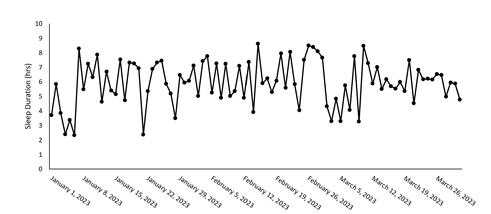
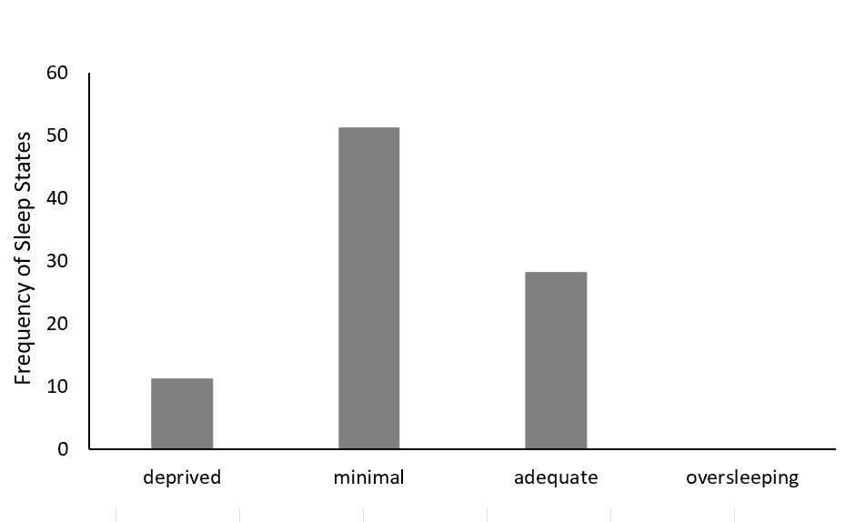

[See a more detailed sleep analysis of my sleep here](https://github.com/anita-westfalewski/381_FinalProject/files/11196914/KNES381finalprojectexcel.xlsx)

 Figure 1. Anita's sleep duration for the months of January, February, and March of 2023. 

 Figure 2. Frequency of sleep states (deprived, minimal, adequate, and oversleeping) based on specified sleep durations. 

